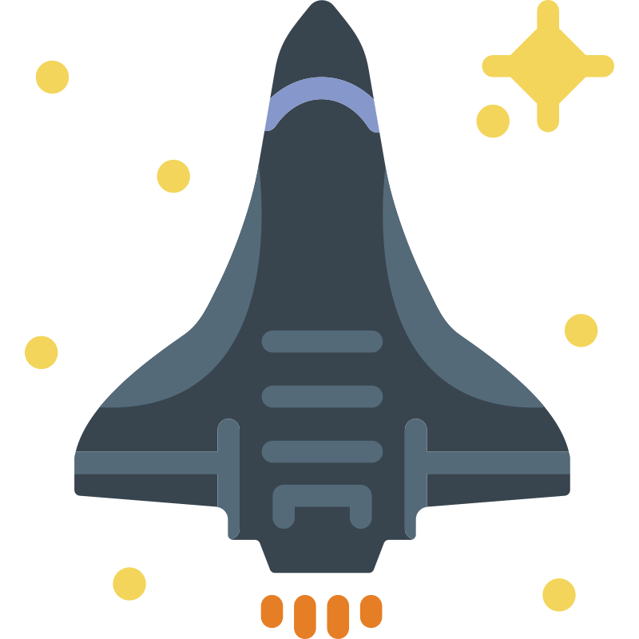
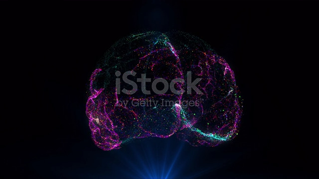

<a name="readme-top"></a>


<!-- PROJECT LOGO -->
<br />
<div align="center">
  <a href="https://github.com/k5tuck/StarMessenger">
    
  </a>

  <h1 align="center">StarMessenger</h1>

<div align="left">
  <a href="https://github.com/k5tuck/StarMessenger/blob/main/.github/workflows/build.yml"></a>
  <a href="https://github.com/k5tuck/StarMessenger/blob/main/.github/workflows/tests.yml"></a>
  <a href="https://github.com/k5tuck/starmessenger/issues"></a>
  <a href="http://doge.mit-license.org"></a>
  <a href="https://ko-fi.com/Z8Z6HR5G8" title="Donate to this project using Buy Me A Coffee"></a>
</div>

  <p align="center">
    <br />
    <!-- <a href="https://github.com/k5tuck/StarMessenger">View Demo</a> -->
    ·
    <a href="https://github.com/k5tuck/StarMessenger/issues">Report Bugs and Request Features</a>
    ·
    <!-- <a href="https://github.com/k5tuck/StarMessenger/issues">New Link</a> -->
  </p>
</div>

<!-- TABLE OF CONTENTS -->
<details>
  <summary>Table of Contents</summary>
  <ol>
    <li>
      <a href="#the-why">The Why</a>
    </li>
    <li>
      <a href="#getting-started">Getting Started</a>
      <ul>
        <li><a href="#prerequisites">Prerequisites</a></li>
        <li><a href="#installation">Installation</a></li>
      </ul>
    </li>
    <li><a href="#usage">Usage</a></li>
    <li><a href="#roadmap">Roadmap</a></li>
    <li><a href="#contributing">Contributing</a></li>
    <li><a href="#license">License</a></li>
    <li><a href="#helpful-links">Helpful Links</a></li>
  </ol>
</details>

<!-- ABOUT -->
## The Why

<p align="center">
  <!-- video src="https://media.istockphoto.com/id/1327081576/video/ai-artificial-intelligence-digital-brain-animation-neural-network-big-data-deep-learning.mp4?s=mp4-640x640-is&k=20&c=tdk5Yl1AJjz1PB0mHxkGXO5MRpaxY2H5Z4qEJ4fxtRk=" loop autoplay controls / -->
    
</p>

This project was started with the ambitious goal of creating a way for individuals to view their own brain activity in real-time; As well as providing a way to enter the world of Neuroscience and BCI (Brain Computer Interface) research.

Check out _The Roadmap_ to see some Future Goals: <a href="#roadmap">See The Roadmap</a>

<p align="right">(<a href="#readme-top">back to top</a>)</p>

<!-- GETTING STARTED -->
## Getting Started
To setup your project and get it running locally, follow the steps below.

### Prerequisites

* Install Premake - **This process will be automated later on.**
  * Go to `https://github.com/premake/premake-core/releases` and download the premake zip folder: `premake-5.0.0-[version]-src.zip`
  * Extract Folder contents and place the executable in **bin** folder in _resources/premake/bin_


### Installation

_Running the below script will auto-generate Visual Studio 2022 project files._

* Run the script `Windows_V22Build` in _resources/scripts_
  ```sh
  ./resource/scripts/Windows_V22Build.bat
  ```

<p align="right">(<a href="#readme-top">back to top</a>)</p>  

<!-- USAGE -->
## Usage

Use this space to show useful examples of how a project can be used. Additional screenshots, code examples and demos work well in this space. You may also link to more resources.

<p align="right">(<a href="#readme-top">back to top</a>)</p>

<!-- ROADMAP -->
## Roadmap

### Star (Game Engine)
- [ ] Add EntryPoint
- [ ] Add Event System and Codes
- [ ] Add Layers
- [ ] Add ImGui and Window Events
- [ ] Add Performance Debugging/Logging
- [ ] Add Renderer API
- [ ] Add Entity Component System
- [ ] Add Shader Language Support/API
### [Kratos](https://github.com/k5tuck/Kratos) (BCI Library)
- [ ] Create BCI / Neuroscience Research Documentation
- [ ] Create EntryPoint / ExitPoint
- [ ] Plan & Create Machine Learning Models to process Brain Waves
- [ ] Learn What I think I know
- [ ] Learn What I know I don't know

See the [open issues](https://github.com/k5tuck/StarMessenger/issues) for a full list of proposed features (and known issues).

<p align="right">(<a href="#readme-top">back to top</a>)</p>

<!-- LICENSE -->
## License

Distributed under the MIT License. See `LICENSE` for more information.

<p align="right">(<a href="#readme-top">back to top</a>)</p>

<!-- ## Contributions -->
## Contributing

Contributions are what make the open source community such an amazing place to learn, inspire, and create. Any contributions you make are **greatly appreciated**.

If you have a suggestion that would make this better, please fork the repo and create a pull request. You can also simply open an issue with the tag "improvements".
Don't forget to give the project a star! Thanks again!

1. Fork the Project
2. Create your Feature Branch (`git checkout -b newfeature/AwesomeNewFeature`)
3. Commit your Changes (`git commit -m 'Add some AwesomeNewFeature'`)
4. Push to the Branch (`git push origin newfeature/AwesomeNewFeature`)
5. Open a Pull Request

<p align="right">(<a href="#readme-top">back to top</a>)</p>

<!-- ACKNOWLEDGMENTS -->
## Huge Technology Thank You!

This project is powered by various open-source projects. Among others:

- [Spdlog](https://github.com/gabime/spdlog) for the awesome logging capabilities
- [ImGui](https://github.com/ocornut/imgui) for the ease of UI Displays
- [GLFW](https://github.com/glfw/glfw) because who wants to implement windows from scratch
- [Glad](https://glad.dav1d.de/) because OpenGL
- [GLM](https://github.com/g-truc/glm) for the graphics math
<!-- - [Welcome Bot](https://github.com/behaviorbot/welcome) to welcome new contributors -->
<!-- - [All Contributors Bot](https://github.com/all-contributors/all-contributors-bot) to recognize the contributions of everyone -->

<p align="right">(<a href="#readme-top">back to top</a>)</p>

## Helpful Links

Use this space to list resources you find helpful and would like to give credit to. I've included a few of my favorites to kick things off!

* [Choose an Open Source License](https://choosealicense.com)
* [GitHub Emoji Cheat Sheet](https://www.webpagefx.com/tools/emoji-cheat-sheet)
* [Img Shields](https://shields.io)
* [GitHub Pages](https://pages.github.com)
* [Font Awesome](https://fontawesome.com)


<!-- MARKDOWN LINKS & IMAGES -->
<!-- https://www.markdownguide.org/basic-syntax/#reference-style-links -->
[contributors-shield]: https://img.shields.io/github/contributors/k5tuck/StarMessenger.svg?style=for-the-badge
[contributors-url]: https://github.com/k5tuck/StarMessenger/graphs/contributors
[forks-shield]: https://img.shields.io/github/forks/k5tuck/StarMessenger.svg?style=for-the-badge
[forks-url]: https://github.com/k5tuck/StarMessenger/network/members
[stars-shield]: https://img.shields.io/github/stars/k5tuck/StarMessenger.svg?style=for-the-badge
[stars-url]: https://github.com/k5tuck/StarMessenger/stargazers
[issues-shield]: https://img.shields.io/github/issues/k5tuck/StarMessenger.svg?style=for-the-badge
[issues-url]: https://github.com/k5tuck/StarMessenger/issues
[license-shield]: https://img.shields.io/github/license/k5tuck/StarMessenger.svg?style=for-the-badge
[license-url]: https://github.com/k5tuck/StarMessenger/blob/master/LICENSE.txt
[linkedin-shield]: https://img.shields.io/badge/-LinkedIn-black.svg?style=for-the-badge&logo=linkedin&colorB=555
[linkedin-url]: https://linkedin.com/in/othneildrew

[product-screenshot]: images/brain.mp4
[Next.js]: https://img.shields.io/badge/next.js-000000?style=for-the-badge&logo=nextdotjs&logoColor=white
[Next-url]: https://nextjs.org/
[React.js]: https://img.shields.io/badge/React-20232A?style=for-the-badge&logo=react&logoColor=61DAFB
[React-url]: https://reactjs.org/
[Vue.js]: https://img.shields.io/badge/Vue.js-35495E?style=for-the-badge&logo=vuedotjs&logoColor=4FC08D
[Vue-url]: https://vuejs.org/
[Angular.io]: https://img.shields.io/badge/Angular-DD0031?style=for-the-badge&logo=angular&logoColor=white
[Angular-url]: https://angular.io/
[Svelte.dev]: https://img.shields.io/badge/Svelte-4A4A55?style=for-the-badge&logo=svelte&logoColor=FF3E00
[Svelte-url]: https://svelte.dev/
[Laravel.com]: https://img.shields.io/badge/Laravel-FF2D20?style=for-the-badge&logo=laravel&logoColor=white
[Laravel-url]: https://laravel.com
[Bootstrap.com]: https://img.shields.io/badge/Bootstrap-563D7C?style=for-the-badge&logo=bootstrap&logoColor=white
[Bootstrap-url]: https://getbootstrap.com
[JQuery.com]: https://img.shields.io/badge/jQuery-0769AD?style=for-the-badge&logo=jquery&logoColor=white
[JQuery-url]: https://jquery.com 
